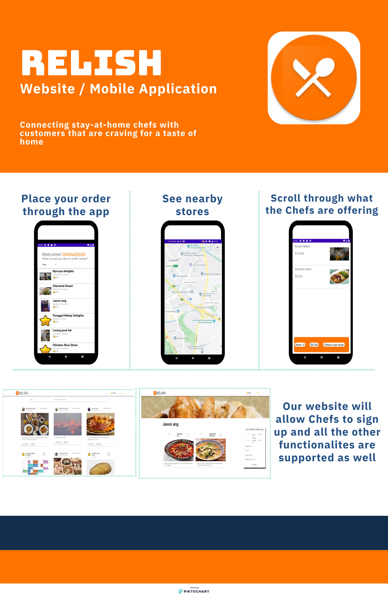

# Relish (CP2106 Orbital)
<h3>A food delivery system that uses an Android Application and website in tandem. </h3> 

|Key features|Description|
|------------|------------|
|Log-in system| Sends requests to database when creating account/ logging in |
|Rolling feed of stores| Scroll through all the Stores in our database|
|Customisable Chef Profile| Able to Customise default picture as well as chef description|
|Order history| Chefs and Customers are able to view past orders|
|Update Transactions| Chefs and Customers are able update their current order status|
|Upload/Delete dish| Chefs can update their menu from the application|
 
|Tech demo|
|---|
|https://drive.google.com/file/d/1zZm0mbqV29PbaT6hSPbB2-5IFmW4bqO3/view?usp=sharing|
<h4>This module was complete under module CP2106</h4>
<h4>This repository only contains the files for the Web Application</h4>
