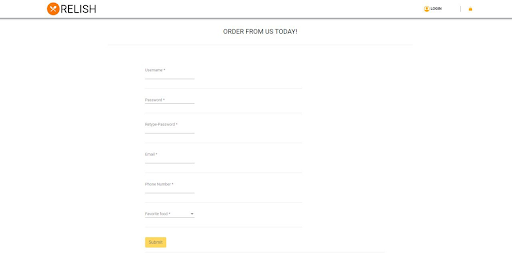
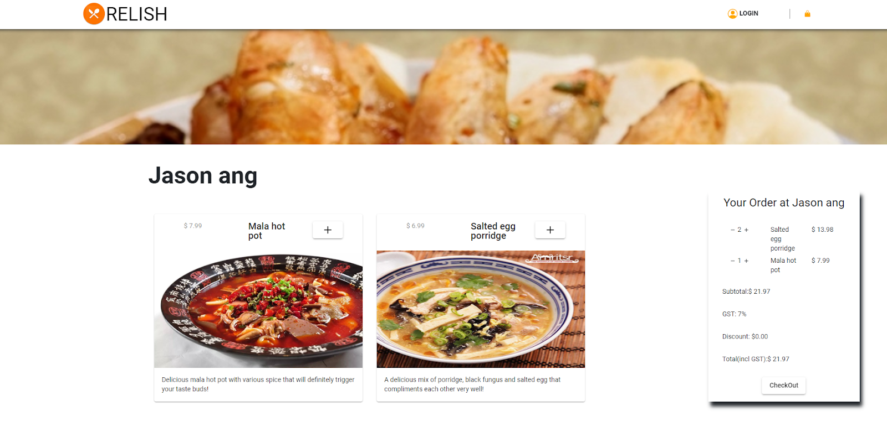
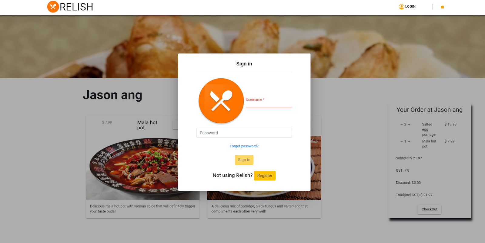
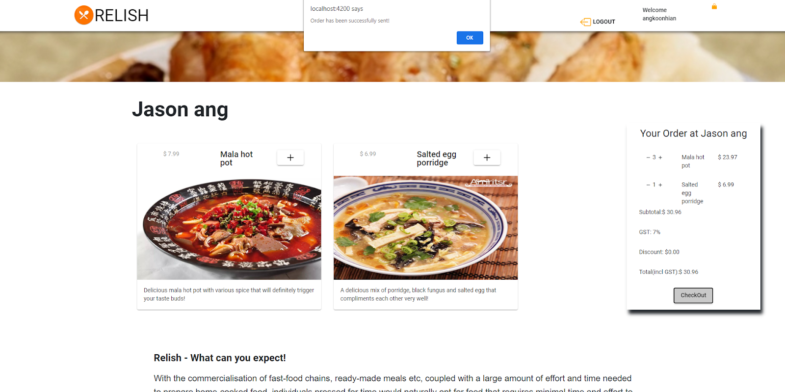

<h1>1. Introduction</h1>
<h2>Motivation:</h2>

Our project aims to recruit stay-home chefs, be it aspiring teenagers who want to dabble in cooking or stay-home spouses that want to showcase their ethnic cuisine, and to connect these chefs to a wider customer base that would rather home-cooked food rather than what is readily available out there now.
Especially during these trying times where people are under strict quarantine, local businesses and hawkers who have to close their physical store will be able to continue business from home. Even if the hawkers choose to stay open, business is affected by the low traffic and delivery services require a commission fee of 30-35% per order. According to local hawker and founder of Hawker Dabao United Melvin Chew, hawkers are suffering a loss of 70% during this pandemic. Our project could help customers that want to support local businesses but are fearful of leaving the home as well as the stores themselves.

<h2>Aim:</h2>

A food delivery service that uses an Android application and a website to connect nearby customers to stay-home cooks.

  
<h1>2. Quick Start</h1>
<h3>Simply visit the website http://relish.dyndns-remote.com/relish/, create an account and get started! Refer to section 3: “Features” for the details of what you can do in the web application. Refer to section 4: “Features” for the details of what you can do in the phone application.</h3>
  
<h1>3.1 Customer Features</h1>
<h2><ul>3.1 Landing Page</ul></h2>

  
<h2><ul>3.2 Login as an existing user</ul></h2>

Enter your username and password and jump right in!

If you do not have an account, click register and refer to 3.3 of this guide!

  
<h2><ul>3.1.3 Registration</ul></h2>

Submit your details accordingly to register with relish!

Upon clicking submit, you will be redirected to the home page logged in.

  
<h2><ul>3.1.4 Browse our home-cooks!</ul></h2>

Filter the cooks by your preferred cuisines with our filter function.

Once you have decided on your home-cooks, visit their stores and see what they have in store for you!

  
<h2><ul>3.1.5. Pick your dish and order!</ul></h2>

Browse through the various home-cook dishes available to you!

Once you have decided on what you want to eat, simply click on the + logo located on the top right of the dishes.

  
<h2><ul>3.1.6. A live order menu to update !</ul></h2>

1. Simply adjust your orders via the live order shown above! Click on - to remove quantity or + to simply add quantity.

2. Once you are done with your order, click on the checkout button at the bottom of your live order.

3. If you have not logged in, our website will prompt you to login before processing your order!

4. If you have already logged in, a pop up will appear to inform you that your order has gone through to the chef!

  
<h1>3.2 Chef Features</h1>
<h2><ul>3.2.1.1 Landing page</ul></h2>

If you are an aspiring home-cook, click on the ‘To the chef Page’ button to join relish!

  
<h2><ul>3.2.1.2 Chef Landing page & registration</ul></h2>

1. Scroll all the way down to register with us!

2. Submit your details accordingly to register with relish as a chef!

3. Click on the chef icon on the top right corner of navbar to login as a chef.

  
<h2><ul>3.2.2 Chef Dashboard</ul></h2>

1. Upon logging in, you will arrive at the chef Dashboard as shown.

2. Right below your circular profile picture, there are 3 buttons. ‘Edit profile’, ‘Edit Home’, ‘Edit About’. ‘Edit profile’ allows you to update your desired profile picture. ‘Edit Home’ allows you to update your home picture where customers are able to view in your store. ‘Edit About’ allows you to give a description about your store.

3. There are also various functionality in the dashboard to be discussed in 3.2.2.1 to 3.2.2.3.

  
<h2><ul>3.2.2.1 Dish Upload</ul></h2>

1. On the Upload Dish section in your dashboard, there are various fields required for you to fill in to upload your dish.

2. Once uploaded, you can refer to 3.2.2.2 to view your menu.

  
<h2><ul>3.2.2.2 Store Menu</ul></h2>

1. If you have recently uploaded and it did not appear on this page, click on the refresh button.

2. If you have decided to not serve the dish anymore, simply click on the delete button shown on each individual dish.

  
<h2><ul>3.2.2.3 Current Orders</ul></h2>

1. Current orders can be seen on the current orders tab.

2. Prepare your food and once it's prepared, a delivery man will come to collect it and once it is collected, simply click on the ‘served’ button to change the order status from pending to delivering as shown.

